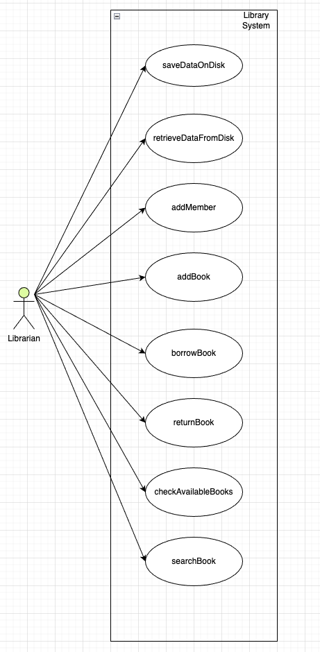
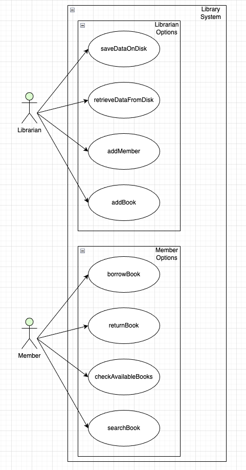
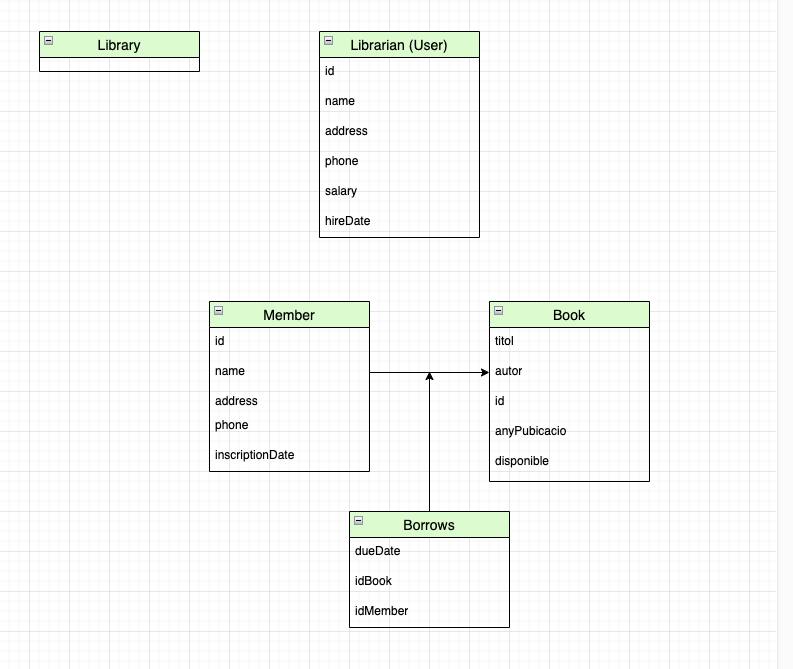
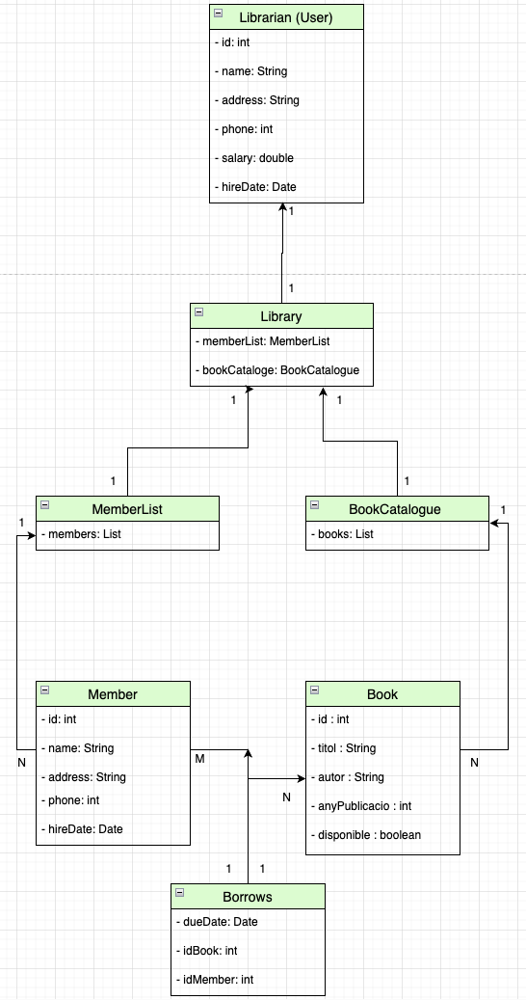
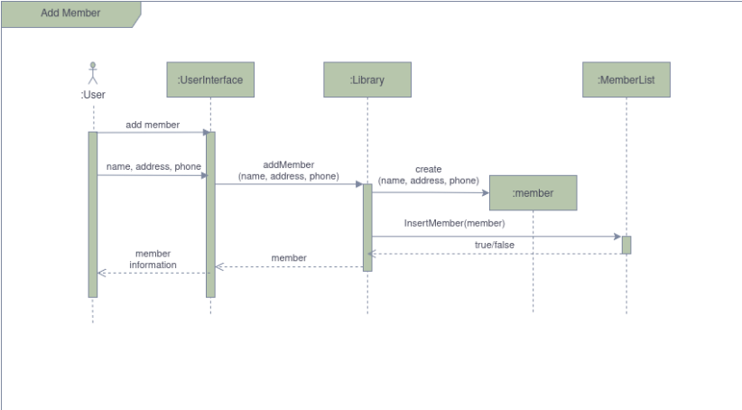
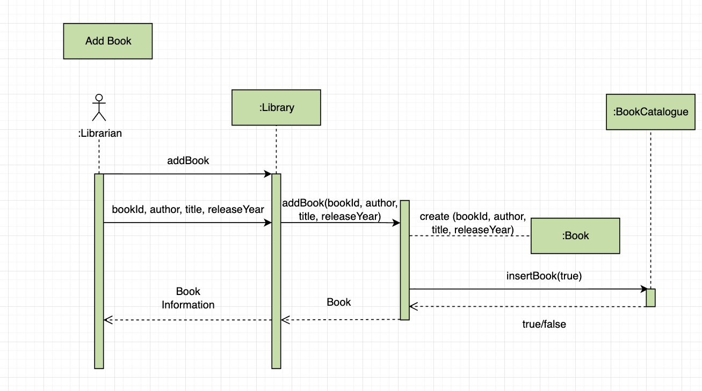
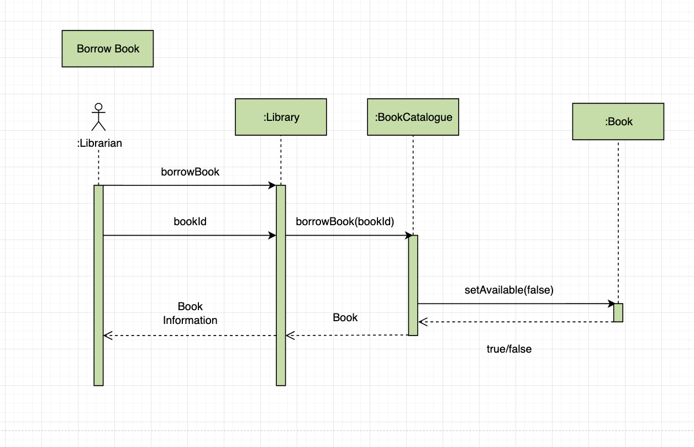
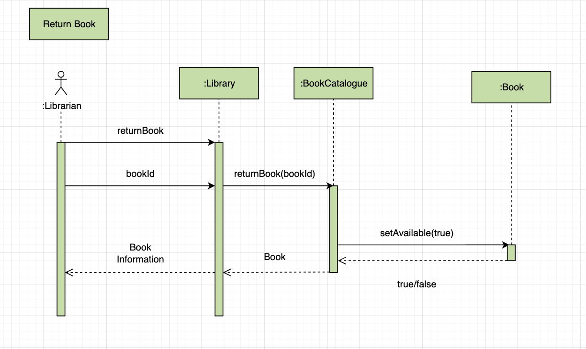
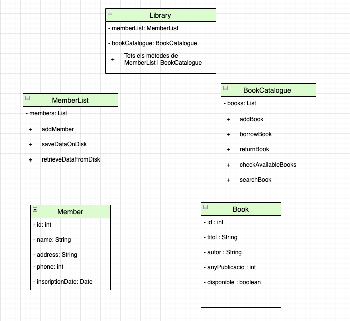

# Anàlisi i Disseny Orientat a Objectes
### Anàlisi i Disseny Orientat a Objectes by Theo, Jordi & Joan

## Tasca 1: Requisits Funcionals
### 1. Gestio d'Usuaris
- Registrar un nou membre a la biblioteca
- Eliminar un membre de la biblioteca

### 2. Gestio de Llibres
- Afegir un llibre a la biblioteca
- Eliminar un llibre de la biblioteca

### 3. Gestio de Prestecs
- Prestar un llibre a un membre
- Gestionar la devolucio d' un llibre per part d' un membre
- Verificar disponibilitat d' un llibre (si aquest ja esta prestat o no)
- BUscar informacio d' un llibre

## Tasca 2: Diagrama de Casos d'Ús
- Primera iteració

- Segona iteració

## Tasca 3: Model d’Interacció
| addMember                      |                      |
|--------------------------------|----------------------|
| Acció realitzada per l' usuari | Resposta del sistema |
| JA ESTÀ FET                    | AL TUTORIAL          |
|                                |                      |
|                                |                      |
|                                |                      |
|                                |                      |
|                                |                      |
|                                |                      |
|                                |                      |

| addBook                                        |                                                               |
|------------------------------------------------|---------------------------------------------------------------|
| Acció realitzada per l' usuari                 | Resposta del sistema                                          |
| L'empleat omple una ficha                      |                                                               |
| L'empleat realitza una solicitut al sistema |                                                               |
|                                                | El sistema solicita la informació                             |
| L'empleat introdueix la informació del llibre  |                                                               |
|                                                | El sistema llegeix les dades i si es posible agrega el llibre |
| L'empleat deixa el llibre al seu lloc          |                                                               |
|                                                |                                                               |
|                                                |                                                               |

| borrowBook                                                                 |                                                    |
|----------------------------------------------------------------------------|----------------------------------------------------|
| Acció realitzada per l' usuari                                             | Resposta del sistema                               |
| L'usuari demana un llibre prestat                                          |                                                    |
| L'empleat busca el llibre al sistema                                       |                                                    |
|                                                                            | El sistema busca si el llibre està  disponible |
| L'empleat comunica al usuari si està disponible o no i el demana si pot |                                                    |
|                                                                            | El sistema reserva el llibre                       |
| L'empleat entrega el llibre al usuari                                      |                                                    |
|                                                                            |                                                    |
|                                                                            |                                                    |

| returnBook                                                    |                                                         |
|---------------------------------------------------------------|---------------------------------------------------------|
| Acció realitzada per l' usuari                                | Resposta del sistema                                    |
| L'usuari dona el llibre al empleat                            |                                                         |
| L'empleat fa la solicitut al sistema per tornar el llibre |                                                         |
|                                                               | El sistema torna a posar el llibre com a disponible |
| L'empleat posa el llibre al su lloc                           |                                                         |
|                                                               |                                                         |
|                                                               |                                                         |
|                                                               |                                                         |
|                                                               |                                                         |

## Tasca 4: Diagrama de Classes Conceptual

## Tasca 5 + 8: Implementació i Finalització del Diagrama de Classes Conceptual
- Per a la tasca 5, aquesta es troba en la carpeta src dins del directori Project, on es poden veure totes les classes amb els seus atributs i metodes.
- Tasca 8

## Tasca 6: Identificació Classes Software

### Library
| Atributs      | Descripcio                                     |
|---------------|------------------------------------------------|
| memberList    | Llista de membres de la biblioteca             |
| bookCatalogue | Llista del catalog de llibres de la biblioteca |
- Basicament, agrupa tant els membres com els llibres d' una biblioteca en una sola classe amb dues llistes, i aquesta classe tindra un patro Singleton per a garantztar uniformitat. 
  Tambe, podra utilitzar tots els metodes de BookCatalogue i MamberList

### MemberList
| Atributs     | Metodes                                                      |
|--------------|--------------------------------------------------------------|
| List(Member) | addMember (afegir nou membre)                                |
|              | saveDataOnDisk (per a guardar la informacio actualitzada)    |
|              | retrieveDataFromDisk (per a obtenir la informacio desitjada) |

### BookCatalogue
| Atributs   | Metodes                                                               |
|------------|-----------------------------------------------------------------------|
| List(Book) | addBook (afegir nou llibre)                                           |
|            | borrowBook (prestar llibre)                                           |
|            | returnBook (retornar llibre)                                          |
|            | checkAvailableBooks (verificar disponibilitat d'un llibre en concret) |
|            | searchBook (buscar informacio d' un llibre en concret)                |

### Book
| Atributs             | Descripcio                                             |
|----------------------|--------------------------------------------------------|
| id (int)             | ID unic identificador d'un llibre                      |
| titol (String)       | Nom del llibre                                         |
| autor (String)       | Any en el que es va publicar el llibre                 |
| anyPublicacio (int)  | El sistema solicita la informació                      |
| disponible (boolean) | Indica si el llibre esta disponible (true) o no (false) |

### Member
| Atributs               | Descripcio                             |
|------------------------|----------------------------------------|
| id (int)               | ID unic identificador d'un membre      |
| name (String)          | Nom del membre                         |
| address (String)       | Direccio del domicili del membre       |
| phone (int)            | Numero de telefon del membre           |
| inscriptionDate (Date) | Data d'alta del membre a la biblioteca |

## Tasca 7: Diagrames de Seqüència
- Add member (ja fet, extret del tutorial)

- Add book

- Borrow book

- Return book

## Tasca 9: Disseny Final

Tots els diagrames estan dins l'arxiu [Diagrames_Joan_Jordi_Theo.drawio](Diagrames_Joan_Jordi_Theo.drawio)
